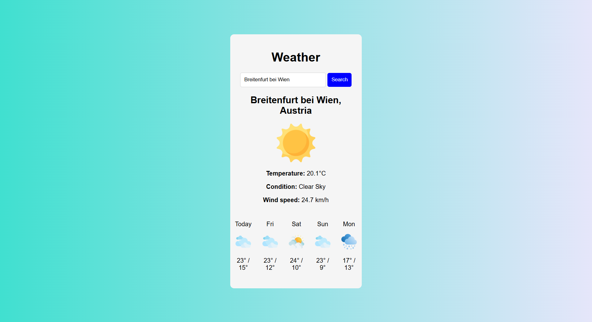
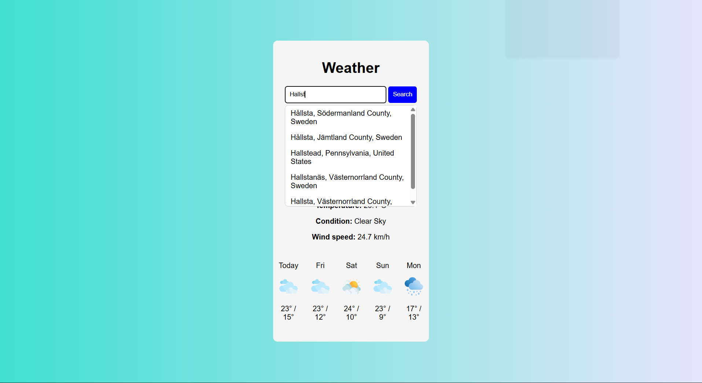
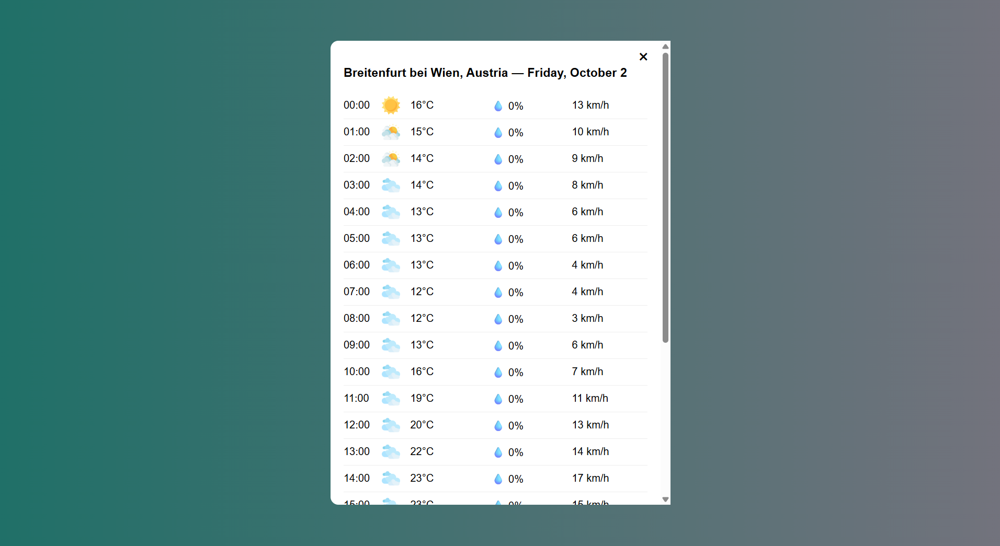

# Weather App

A simple weather application built with vanilla JavaScript and the Open-Meteo API.

The application allows users to search for a city and view the current weather conditions, temperature, and wind speed.

## Features

- Search weather by city
- Geocoding API integration
- Current weather data
- Weather condition detection
- Dynamic weather icons
- Temperature display
- Wind speed display
- Country information

## Tech Stack

- HTML5
- CSS3
- JavaScript (ES6+)
- Fetch API
- Open-Meteo API
- REST API
- DOM API

## APIs

This project uses the Open-Meteo APIs:

- Geocoding API — converts a city name into geographic coordinates
- Weather API — provides current weather data

## What I Practiced

Working with REST APIs
Using fetch() and async/await
Processing JSON responses
Working with asynchronous JavaScript
DOM manipulation
Handling user input
Mapping API data to UI elements
Working with external resources

## Screenshots

